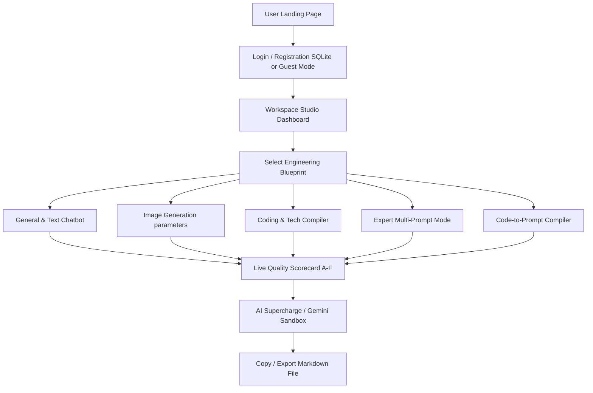

# 🚀 PromptCraft AI

<div align="center">

[](https://promptcraftaistudio.netlify.app/)
[](LICENSE)
[](https://nodejs.org/)
[](https://expressjs.com/)
[](https://sqlite.org/)

**PromptCraft AI is a professional, high-performance Prompt Engineering Studio built to compose elite mega-prompts with guided steps, real-time metric analysis, template variables, and an interactive Gemini execution sandbox.**

[🌐 Launch App Live](https://promptcraftaistudio.netlify.app/) | [📘 Local Setup](#-how-to-run-locally) | [📄 View License](LICENSE)

</div>

---

## 🧭 Application Flow



---

## ✨ Features

* **🤖 Conversational Chatbot**: Dynamic, guided conversation compiler using advanced prompt architectures.
* **📋 Live Split-Editor**: Real-time side-by-side prompt compilation preview while typing.
* **⚡ Gemini Integration**: Supercharge, expand, or run test simulations directly in the sandbox.
* **📊 Quality Scorecard**: Automatic heuristic checking and grading (A-F) based on template structural criteria.
* **🧬 Dynamic Variables**: Instantly detects and parses `{{placeholder_variables}}` into editable input fields.
* **💾 Saved Presets Library**: Save, load, modify, and delete templates locally.
* **🌌 Cosmic Glassmorphism**: Stunning premium dark-mode theme, micro-animations, and full responsive design.

---

## 🛠️ File Structure

| File | Description |
| :--- | :--- |
| 📄 [index.html](index.html) | Product landing/marketing showcase page. |
| 🔑 [auth.html](auth.html) | Glassmorphic user login, register, and gatekeeper portal. |
| 💻 [app.html](app.html) | Core application workspace canvas dashboard. |
| ⚙️ [app.js](app.js) | Chatbot logic, score evaluation, variables parser, and Gemini integrations. |
| 🛡️ [server.js](server.js) | Express.js authentication REST API backed by SQLite. |
| 🎨 [style.css](style.css) | Core styles including glassmorphism rules, transitions, and layout resets. |
| 🗃️ [promptcraft.db](promptcraft.db) | Local database storing developer accounts (auto-created). |
| 📦 [package.json](package.json) | Package description, scripts, and server dependencies. |

---

## 💾 Database Schema (`users` Table)

| Field | Type | Description |
| :--- | :--- | :--- |
| **`id`** | `INTEGER` | Primary Key (Auto-Increment) |
| **`name`** | `TEXT` | User's full registration name |
| **`email`** | `TEXT` | Unique, lowercase-normalized email index |
| **`password`** | `TEXT` | Hashed password (using `bcryptjs` salt rounds=10) |
| **`created_at`** | `DATETIME` | Time of sign-up (auto-generated) |

---

## 🚀 How to Run Locally

### 1. Full-Stack SQLite Server Mode (Recommended)
This mode enables the secure login page and saves developer accounts to the database.
```bash
npm install
npm start
```
* **Local Web Address:** `http://localhost:3000`

### 2. Standalone Offline Mode
* Simply open `index.html` directly in any web browser.
* Bypasses the login barrier and operates client-only using `localStorage`.

---

## 🧠 Prompt Engineering Best Practices

PromptCraft AI templates are designed according to **CO-STAR** and expert-level instruction principles:

| Methodology Block | Role / Purpose |
| :--- | :--- |
| **Role / Persona** | Sets the context or perspective for the AI (e.g. *Senior Python Developer*). |
| **Objective / Task** | The specific goal or instruction the AI must perform. |
| **Context** | Background information or source code data the AI requires. |
| **Constraints** | Positive & negative boundaries (e.g. *do not use external imports*). |
| **Format** | How the output should be structured (e.g. *markdown list, JSON, etc.*). |

---

## 📄 License

**Proprietary License**. All rights reserved by **Prachi Garg**.  
Unauthorized copying, duplication, modification, or commercial exploitation of this Software or any of its files is strictly prohibited. Refer to the [LICENSE](LICENSE) file for the full legal terms.

---
*Made with 💜 by Prachi Garg.*
