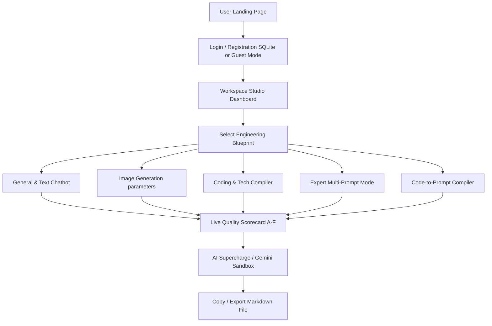

# PromptCraft AI 🚀

> **🌐 Live Deployment Link:** [promptcraftaistudio.netlify.app](https://promptcraftaistudio.netlify.app/)

PromptCraft AI is an interactive, premium prompt-engineering studio. It guides users through crafting high-performing LLM prompts using professional frameworks.

---

## 🧭 Application Flow



---

## ✨ Features

* **🤖 Conversational Chatbot**: Multi-step guides for structured objectives.
* **📋 Live Split-Editor**: Real-time prompt compilation preview.
* **⚡ Gemini Integration**: Supercharge or test drafts client-side.
* **📊 Quality Scorecard**: Automated template metrics grading (A-F).
* **🧬 Dynamic Variables**: Binds `{{placeholders}}` into inputs automatically.
* **💾 Saved Library**: Store, edit, and load prompts locally.
* **🌌 Cosmic Glassmorphism**: Responsive design with clean transitions.

---

## 🛠️ File Structure

* [index.html](index.html) - Landing Showcase page.
* [auth.html](auth.html) - Login/Register portal.
* [app.html](app.html) - Workspace canvas.
* [app.js](app.js) - App compilation & chatbot logic.
* [server.js](server.js) - SQLite-backed Express REST API.
* [style.css](style.css) - Premium visual design stylesheet.
* [promptcraft.db](promptcraft.db) - Generated account database.
* [package.json](package.json) - Application dependencies.

---

## 💾 Database Schema (`users` Table)

* `id` - Auto-increment Primary Key
* `name` - Full Name
* `email` - Sanitized unique email
* `password` - Bcrypt-hashed string
* `created_at` - Automatic timestamp

---

## 🚀 How to Run Locally

### 1. Backend SQLite Mode (Recommended)
```bash
npm install
npm start
```
* Access at: `http://localhost:3000`

### 2. Standalone Frontend Mode
* Drag and drop `index.html` into your web browser.
* Runs entirely offline utilizing browser `localStorage`.

---

## 🧠 Engineering Methodologies

PromptCraft AI uses structured formats inspired by **CO-STAR**:
* **Role**: Defines the AI actor.
* **Task**: Primary target action.
* **Context**: Input details.
* **Constraints**: Formatting limits.
* **Format**: Structure requirements.

---

## 📄 License

Proprietary License. All rights reserved by Prachi Garg. Unauthorized copying, distribution, modification, or commercial exploitation of this Software or any of its files is strictly prohibited. Refer to the [LICENSE](LICENSE) file for the full terms.

---
*Made with 💜 by Prachi Garg.*
